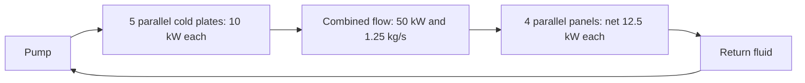

# Preliminary Assessment of a Project Suncatcher–Style LEO AI Satellite Constellation

[日本語](README.md) | English

This project estimates **power, thermal, mass, and communications requirements for a common workload** in a low Earth orbit (LEO) satellite constellation combining solar generation, AI computing, and optical inter-satellite links.

Using public information and explicit design assumptions, it compares continuous 100 kW AI computing on one satellite with synchronous training across 81 satellites. This is an independent study inspired by Google's Project Suncatcher; its results are not specifications or performance predictions for Google's spacecraft.

**Status: preliminary sizing and conditional thermal balance assessment / Updated: 2026-10-05**

## Findings so far

| Subject | Result under the stated assumptions | Assessment still needed |
|---|---|---|
| Continuous 100 kW computing on one satellite | Total power draw of 117.65 kW; solar array area of 381–463 m²; battery capacity of 17–71 kWh | Deployment, lifetime, and power balance throughout the orbit |
| Spacecraft heat rejection | Effective radiating area of 215.8 m² at a mean surface temperature of 59.5°C and absorbed external heat flux of 45 W/m² | Actual attitude, external thermal environment, and local temperatures |
| Mass | Solar arrays, batteries, and radiator panels subtotal 2.80–3.39 metric tonnes | Complete spacecraft mass, including computing, heat transport, structure, communications, and propulsion |
| Single phase heat transport | Rigid pipe walls plus comparison fluid inside the pipes: 186.2 kg for the medium diameter case | Actual pumps, cold plates, joints, total pressure drop, and flight fluid |
| Thermal assessment with assumed geometry | Improved structure with 500 W heat sources gives a junction temperature of 88.11°C at 45 W/m² external absorption, and 95.59°C at 100 W/m² | Actual interfaces, local heat generation, flow imbalance, and temperature margin |
| Synchronous training across 81 satellites | Reference bandwidth at which communication time equals compute time: 9.84 Tbps per satellite, per direction | Link topology, terminal power and mass, and training performance |

**The models identify conditions that admit a steady solution for rejecting 100 kW of heat. Feasibility of a complete flight spacecraft remains undetermined.** For a single satellite, the priorities are heat transport, the radiator environment, and component mass estimates. For a cluster, link architecture and formation flight require evaluation. Ranking the limiting subsystems also requires specifying the available capacity of each subsystem.

## Background and public evidence

Google's research proposes space AI infrastructure using solar generation, TPUs, close formation flight, and optical links. The paper presents an example with 81 satellites at a mean altitude of 650 km and a cluster radius of 1 km, together with a **ground bench** demonstration of 800 Gbps unidirectional / 1.6 Tbps total bidirectional transmission. Approximately 10 Tbps is a link design target; the paper's 9.6 Tbps example is total bidirectional bandwidth. [Google research paper, v2](https://arxiv.org/html/2511.19468v2)

Google's official announcement of October 1, 2026 confirms the prototype satellite's launch, established contact, and expected operation. It describes subsequent orbital data collection; it does not demonstrate continuous 100 kW operation or the thermal performance calculated here. [Google announcement](https://blog.google/innovation-and-ai/models-and-research/google-research/project-suncatcher-prototype/)

## Scope and common assumptions

The five assessment areas are thermal management, power and orbital eclipse, inter-satellite communications and formation flight, launch mass, and ground links and stations. The common workload is **continuous delivery of 100 kW of AI computing power per satellite**, at an altitude near 650 km and an orbital period of approximately 97.6 minutes.

| Input | Reference value | Interpretation |
|---|---:|---|
| Fraction of total power used for computing | 0.85 | Assumption; total draw = 100/0.85 = 117.65 kW |
| Auxiliary power budget | 17.65 kW | Budget allocation, not a sum of specified components |
| Illumination cases | 95% sunlight / approximately 4.9 min eclipse; 20 min eclipse / approximately 79.5% sunlight | Comparison assumptions, not annual guarantees |
| Solar constant, cell efficiency, and implementation factor | 1,361 W/m², 0.30, 0.80 | Efficiency and implementation factor are assumptions |
| Battery charge efficiency, discharge efficiency, depth of discharge, and reserve factor | 0.95, 0.95, 0.70, 1.20 | Assumptions |
| Solar array areal mass / battery pack specific energy | 2.5 kg/m² / 140 Wh/kg | Suitability for this spacecraft has not been verified |
| Junction temperature limit | 95°C | Scenario limit, not an actual TPU specification |
| Initial mean radiator surface temperature | 332.65 K = 59.5°C | Initial value based on an assumed 35.5 K difference from the junction |
| Emissivity / absorbed external heat flux | 0.85 / 45 W/m² | Assumptions; 45 W/m² does not represent the worst LEO hot case |
| Radiator panel areal mass | 8 kg/m² | The initial mass budget uses effective radiating area as the area basis |

Public specifications, design assumptions, and calculated results are identified separately. Unspecified component quantities are **TBD (to be determined)** and are not assigned 0 kg or 0 W.

## Power, radiator area, and partial mass

All mass values in `t` denote metric tonnes (1 t = 1,000 kg).

| Item | High illumination: approximately 4.9 min eclipse | Long eclipse: 20 min |
|---|---:|---:|
| Solar array collecting area | 381.18 m² | 463.03 m² |
| Solar array mass | 0.953 t | 1.158 t |
| Battery nameplate capacity | 17.27 kWh | 70.77 kWh |
| Battery pack mass | 0.123 t | 0.505 t |
| Effective radiating area for the whole spacecraft | 215.80 m² | 215.80 m² |
| Assumed radiator panel mass | 1.726 t | 1.726 t |
| **Subtotal of these three components** | **2.803 t** | **3.389 t** |

The 215.80 m² estimate assumes that the full 117.65 kW of electrical consumption becomes heat delivered to surfaces at the same temperature, with 45 W/m² of external absorption deducted from gross radiation. Physical panel geometry, radiation from one or both sides, shielding, inactive area, and deployment structures remain unspecified in this initial mass budget.

The subsequent main loop model uses **183.44 m²** for the 100 kW computing load. The initial area corresponding to auxiliary heat is approximately 32.38 m²; the difference from 215.80 m² reflects the heat loads covered. If auxiliary heat is assigned to local radiators operating at different temperatures, their areas must be recalculated for those conditions.

Computing hardware, HBM, boards, power conversion, heat acquisition and transport, deployment and central structures, attitude control, propulsion, communications, and radiation protection and redundancy have not been fully estimated. The earlier 3.92–4.75 t figure, obtained by adding a blanket 40% to the three component subtotal, is a historical comparison metric. It is not used as complete spacecraft mass or as a component mass budget.

Assuming a 5 t launch mass ceiling, a 15% dry mass reserve, and zero propellant and adapter mass, the remaining allowance after subtracting the three components and 186.2 kg of rigid pipes plus internal fluid is approximately 1.36 t for high illumination and 0.77 t for the long eclipse case. These are conditional remaining allowances with propellant and other items omitted; they do not establish compliance with a 5 t limit. [Detailed mass budget](100kW単機_詳細質量予算.md)

<details>
<summary>Equations for reproducing power and area estimates</summary>

`P_total` is total power draw [W], `f` is the sunlit fraction, `S` is the solar constant [W/m²], `η_cell` is cell efficiency, and `d` accounts for implementation, temperature, and degradation.

```text
P_total = 100,000 / 0.85
p_solar = S × η_cell × d = 1,361 × 0.30 × 0.80
A_solar = P_total × [f + (1−f)/(η_charge η_discharge)] / (p_solar f)
E_bat[kWh] = P_total[kW] × t_eclipse[h] / (η_discharge × DOD) × reserve
q_net = ε σ T_surface⁴ − q_abs
A_rad = Q_heat / q_net
σ = 5.670374419 × 10⁻⁸ W/(m² K⁴)
```

At 332.65 K, ε = 0.85, and q_abs = 45 W/m², net heat rejection is approximately 545.17 W/m². This initial approximation accounts for external absorption separately and omits the approximately 3 K space background term.

</details>

## Single phase heat transport and thermal balance

The comparison architecture uses ten 10 kW modules and **two independent 50 kW loops**. Each loop collects heat from five 10 kW cold plates. After flow merging and redistribution, four main radiator panels each reject a net 12.5 kW. The different numbers of cold plates and panels are compatible with the heat and flow balance of the complete loop.



The diagram represents one loop. Together, the two loops handle 100 kW of computing heat. If one loop stops, the computing modules on that side are assumed to shut down. Maintaining 100 kW after a loop failure requires a separate design with full redundancy.

### Partial piping estimate

The comparison uses water properties near 60°C, a 10 K fluid temperature change, 186 m of rigid piping across the spacecraft, and a 1 mm pipe wall. Assumed internal diameters are 32 mm for the main lines and headers, 16 mm for panel branches, and 12 mm for module branches. Water has not been selected as the flight fluid.

| Medium diameter, 10 K case | Piping v0.2 result |
|---|---:|
| Mass flow rate | 1.25 kg/s per loop |
| Pipe walls plus internal comparison fluid | 186.2 kg for the spacecraft |
| Path pressure drop for straight pipes and target flow balancing | 59.579 kPa per loop |
| Pump electrical power corresponding to the above | 0.354 kW for both loops combined |

Cold plate and panel internal channels, entrances and exits, bends, joints, valves, filters, and other losses are separate items. The 0.354 kW value is not the required power of a complete pump system. The change from the initial v0.1 values of 62.8 kPa and 0.37 kW follows from a more detailed header flow model. [Piping model v0.2](100kW単機_単相熱輸送v0.2.md)

### Screening with assumed panel thermal resistance

Holding the main effective radiating area at 183.44 m², ε = 0.85, and external absorption at 45 W/m², varying the fluid-to-surface thermal resistance per unit area `R''` gives the following hot fluid temperatures required to reject 100 kW. This stage precedes assigning pump heat to the main loop.

| Panel thermal resistance | Hot / cold fluid temperature | Remaining temperature difference up to a 95°C junction |
|---:|---:|---:|
| 0.010 m² K/W | 70.01 / 60.01°C | Approximately 24.99 K |
| 0.020 m² K/W | 75.46 / 65.46°C | Approximately 19.54 K |
| 0.030 m² K/W | 80.91 / 70.91°C | Approximately 14.09 K |

The approximately 25 K allowance is close to the temperature limit; a design margin is still needed. The 10 K fluid inlet-to-outlet difference is not simply added to the earlier 35.5 K temperature budget. [Thermal balance screening](100kW単機_熱収支スクリーニングv0.1.md)

### Thermal model derived from geometry: current progress

The latest model derives thermal resistance from panel tube spacing, skin thickness, and bonding layers, together with chip layers and microchannels. It assumes eight main panels, each 2.5 × 9.172 m, with **only the front face radiating**. The back face is insulated, and loss of active front area is assumed to be zero for this comparison.

The following junction temperatures result when each 10 kW cold plate serves **twenty 500 W heat sources, each 40 mm × 40 mm**. Pump heat is assigned to the main fluid. Unknown contact resistance and additional spreading losses are not yet included.

| Absorbed external heat flux | 20 tubes/panel + 120 channels/heat source | 32 tubes/panel + 160 channels/heat source |
|---:|---:|---:|
| 45 W/m² | 95.17°C | 88.11°C |
| 100 W/m² | 102.64°C | 95.59°C |
| 150 W/m² | 109.03°C | 101.98°C |
| 200 W/m² | 115.09°C | 108.04°C |


For the 32 tube / 160 channel case, the external absorption boundary for the 90°C comparison target, which allows 5 K below the 95°C limit, is approximately 58.55 W/m². Even at 45 W/m², only approximately 1.89 K remains for unknown additional temperature rises after reserving that 5 K margin. With **ten 1 kW heat sources per module** and the same 40 mm × 40 mm source area and channel dimensions, this configuration reaches approximately 108.65°C. Results for the 500 W case cannot be transferred to the 1 kW case.

For the reference 20 tube / 120 channel structure, known pressure losses from piping, cold plate channels, and panel channels total 103.03 kPa per loop, with approximately 0.613 kW of pump electrical power for both loops combined. This heat is moved from the existing 17.65 kW auxiliary budget into the main loop: 100.613 kW of main heat plus 17.037 kW of remaining auxiliary heat equals 117.65 kW for the spacecraft. Pump heat is not added to that spacecraft total a second time.

The model indicates that both a layout with low external absorption and an adequate local chip thermal path are needed. Changing the heat transfer correlation alone shifts the reference result by approximately 2.48 K, so feasibility near 95°C remains unresolved. End-of-life (EOL) optical properties, changing orbital and attitude-dependent heat inputs, flow imbalance, transients, freezing, boiling, and pressure qualification are further assessment areas. [External thermal environment and geometry model](100kW単機_外部熱環境と構造モデルv0.1.md)

**The communications case B assumption of 100 chips × 1 kW and the thermal geometry model assumption of 200 heat sources × 500 W are independent comparison cases. A unified spacecraft implementation connecting them has not yet been developed.**

## Communications by workload

| Case | Assumed workload | Main assessment areas |
|---|---|---|
| A: processing within one satellite | Inference and selection of observation data; results downlink of 1–10 GB/day | Thermal management, power, and mass |
| B: synchronous training across 81 satellites | 100B dense model; 4 million global tokens/step; synchronization every step | Inter-satellite links, formation flight, and onboard memory |
| C: inference for ground users | Input and output of 10 TB/day each | Ground links, station placement, and availability |

### Case B: what 9.84 Tbps means

Ironwood's published BF16 peak of 2,307 TFLOPS/chip is used as a compute reference. [Google Cloud specifications](https://docs.cloud.google.com/tpu/docs/tpu7x) The 100 chips per satellite, 1 kW per chip equivalent, 40% effective compute utilization, and 2 bytes per gradient parameter are **assumptions made in this project**. They are not verified measurements of Ironwood's radiation tolerance, orbital performance, or power draw.

```text
P = 100B = 10¹¹ parameters
G = 4,000,000 tokens/step, N = 81 satellites
F_sat = 100 × 2,307 TFLOPS × 0.40 = 92.28 PFLOPS
S = 2 × P = 200 GB/step
D_node = 2(N−1)S/N ≈ 395.06 GB/step       # Sent by each node in Ring All-Reduce
T_compute = 6PG/(N F_sat) ≈ 0.321 seconds/step
B_req = 8D_node/T_compute ≈ 9.84 Tbps per satellite, per direction
```

The receive direction carries the same amount of data. **9.84 Tbps is the reference bandwidth at which communication time equals compute time.** Without overlapping communication and computation, the step duration is approximately doubled and the fraction of step time spent computing is 50%. Lower bandwidth increases waiting time.

| Global tokens/step | 20% utilization | 40% utilization | 60% utilization |
|---:|---:|---:|---:|
| 1 million | 19.7 | 39.4 | 59.1 |
| 4 million | 4.92 | **9.84** | 14.8 |
| 16 million | 1.23 | 2.46 | 3.69 |

Values are Tbps per satellite, per direction, with synchronization every step. The range is 1.23–59.1 Tbps, indicating strong dependence on training assumptions. Model size `P` cancels in this simplified expression, but memory capacity, optimizer state, and extra communication arising from onboard parallelism still matter.

Scaling comparisons also depend on the workload definition. With global `G` fixed, 9/27/81/243 satellites require approximately 0.98/3.20/9.84/29.8 Tbps. Holding tokens/step per satellite fixed while increasing `G` gives approximately 8.86/9.60/9.84/9.93 Tbps. Increasing the synchronization interval `k` reduces average communication per step by approximately 1/k, but the data volume at synchronization and the effects on training quality require separate evaluation.

### B2: link count and waiting time

```text
C_node = m × R_link × u
ρ = B_req/C_node = T_comm/T_compute
step time = T_compute × (1+ρ)             # No overlap of communication and compute
fraction of step time spent computing = 1/(1+ρ)
```

`m` is the number of simultaneous transmit links, `R_link` is the physical rate of one link in one direction, and `u` accounts for throughput losses from coding, protocols, pointing, and related factors. Fixed latency is assessed separately. `m` is not necessarily the number of physical terminals.

| Rate of one link in one direction | Simultaneous transmit links | u | Effective capacity in one direction | ρ | Fraction of step time spent computing |
|---:|---:|---:|---:|---:|---:|
| 0.8 Tbps (ground bench rate) | 4 | 0.8 | 2.56 Tbps | 3.85 | 20.6% |
| 5 Tbps (design assumption) | 4 | 0.8 | 16 Tbps | 0.62 | 61.9% |

Adding link capacities does not by itself establish a workable topology, uncongested routes, or an achievable All-Reduce schedule. Bandwidth comparisons must use matching transmit and receive directions rather than comparing a unidirectional requirement with a bidirectional total. B2 is frozen at the definitions and sensitivity tables; B3, covering optical terminal power, mass, and heat generation, has not started. [Case B sensitivity analysis](<ケースB 感度分析(1).md>)

### Cases A and C: daily data volume and ground stations

10 TB/day corresponds to an average of approximately 0.93 Gbps in each direction. NASA TBIRD's 200 Gbps demonstration was a space-to-ground link; it does not establish uplink performance or year-round service availability. [NASA demonstration report](https://www.nasa.gov/centers-and-facilities/ames/nasa-partners-achieve-fastest-space-to-ground-laser-comms-link/)

```text
Average required rate = 8 × D_day / 86,400
Daily downlink volume per station = R_down × T_contact × p_clear × u / 8
```

In an **illustrative scenario** with a 200 Gbps downlink, 600 seconds/day of contact, a 0.5 optical link availability factor, and 0.6 effective utilization, each station delivers 4.5 TB/day. A 10 TB/day downlink therefore needs at least three stations on capacity grounds. Operations accounting for overlapping contact windows, correlated clouds and weather, uplink capability, delivery deadlines, and station locations have not been assessed.

## Documentation and reproduction

The detailed notes are snapshots of the study at different stages and are **in Japanese**. Use v0.2 for representative piping results and geometry model v0.1 for structural and environmental sensitivities. Older piping values and area-based mass assumptions in the initial mass budget must not be combined as if they were complete spacecraft results for the latest structure.

| Document | Contents |
|---|---|
| [Case B sensitivity analysis](<ケースB 感度分析(1).md>) | Global tokens, compute utilization, synchronization interval, satellite count, and link architecture; B2 frozen |
| [Detailed mass budget](100kW単機_詳細質量予算.md) | Component TBDs, area and mass accounting boundaries, and comparison of single phase, two phase, and LHP/CPL approaches |
| [Single phase heat transport v0.1](100kW単機_単相熱輸送v0.1.md) | Initial piping, diameter, and fluid temperature sensitivities; predecessor of v0.2 |
| [Single phase heat transport v0.2](100kW単機_単相熱輸送v0.2.md) | Header flow, 20 paths, and failure operation requirements |
| [Thermal balance screening](100kW単機_熱収支スクリーニングv0.1.md) | Temperature requirements derived from assumed panel thermal resistance |
| [External thermal environment and geometry model](100kW単機_外部熱環境と構造モデルv0.1.md) | Thermal resistance derived from dimensions, pump heat, and all 40 cases |

Run the scripts with Python 3.10 or later from the directory containing the files. Numerical calculations and CSV output use the standard library. Regenerating the latest geometry model's PNG requires `matplotlib`.

```bash
python thermal_loop_v02.py
python thermal_balance_v03.py
python thermal_structure_v04.py
```

To regenerate the figure as well:

```bash
python -m pip install matplotlib
python thermal_structure_v04.py
```

CSV files are written beside their scripts, replacing results with the same filenames. Each script can run independently.

| Code | Main outputs |
|---|---|
| [thermal_loop_v02.py](thermal_loop_v02.py) | [12 cases](thermal_loop_v02.csv), [20 paths](thermal_paths_v02.csv) |
| [thermal_balance_v03.py](thermal_balance_v03.py) | [6 panel resistance cases](thermal_balance_v03.csv) |
| [thermal_structure_v04.py](thermal_structure_v04.py) | [All 40 cases](thermal_structure_v04.csv), [environmental input boundaries](thermal_limits_v04.csv), structural breakdown CSVs, and PNG |

## Open questions and next steps

1. **Orbit, attitude, and external thermal environment:** separate direct sunlight, albedo, Earth infrared, and radiation from surrounding structures; assess hot/nominal/cold conditions, eclipse, beta angle, shielding, and beginning-of-life/end-of-life (BOL/EOL) optical properties.
2. **Local chip and cold plate thermal paths:** incorporate actual packages, thermal interface materials (TIMs), local heat flux, entrance regions, conjugate heat transfer, flow distribution, and blockage.
3. **Fluid system and failure operation:** include actual component pressure losses, pump performance, fluid compatibility, pressure, boiling, freezing, and transients during shutdown, startup, and loss of one loop.
4. **Component mass:** define what the 8 kg/m² panel assumption includes; avoid counting internal channels, fluid, supports, and deployment hardware twice; estimate computing, power, communications, and propulsion hardware.
5. **Cluster and service operation:** develop the B3 terminal budget, communications topology, memory and training convergence analysis, formation control, and ground station availability assessment.

Liquid droplet radiators are a separate concept study and have not been integrated into this single satellite model's mass or temperature results. Comparisons of single phase loops, mechanically pumped two phase loops, and loop heat pipes/capillary pumped loops (LHP/CPL) should proceed after the inputs above are made concrete. Economic assessment requires complete spacecraft kg/kW, lifetime, replacement frequency, and launch and operating costs.

## Main sources

- [Google Research — Towards a future space-based, highly scalable AI infrastructure system design, arXiv v2](https://arxiv.org/html/2511.19468v2): example formation, optical links, radiation testing, and research questions.
- [Google — Project Suncatcher prototype satellite is in orbit, 2026-10-01](https://blog.google/innovation-and-ai/models-and-research/google-research/project-suncatcher-prototype/): prototype launch, established contact, and expected operation.
- [Google Cloud — TPU7x (Ironwood)](https://docs.cloud.google.com/tpu/docs/tpu7x): public specifications, including peak BF16 performance.
- [NASA — State-of-the-Art of Small Spacecraft Technology: Thermal Control](https://www.nasa.gov/smallsat-institute/sst-soa/thermal-control/): external heat inputs, radiation, heat transport, and thermal control.
- [NASA — TBIRD 200 Gbps space-to-ground demonstration](https://www.nasa.gov/centers-and-facilities/ames/nasa-partners-achieve-fastest-space-to-ground-laser-comms-link/): demonstrated downlink.

Sources and applicability limits for fluid properties, heat transfer and pressure loss correlations, laminar channels, and radiator analysis are documented in the detailed notes.
