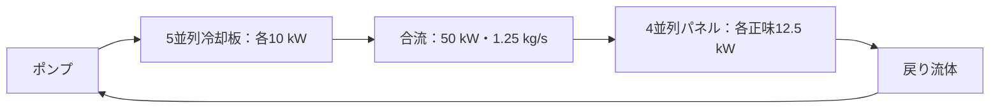

# Project Suncatcher型・低軌道AI衛星群の概算評価

太陽光発電・AI計算機・衛星間光通信を組み合わせた低軌道衛星群について、**電力、熱、質量、通信の要求量を同じ仕事量から見積もる**概算評価プロジェクトです。

公開情報と明示した設計仮定を用い、単機100 kWの連続AI計算から、81機の同期学習までを比較します。GoogleのProject Suncatcherを参考にした独立の検討であり、同社の実機仕様・性能予測ではありません。

**状態：設計初期の概算・条件付き熱収支評価／更新：2026-10-05**

## 現時点で分かったこと

| 評価対象 | 仮定の下で得た結果 | 残る判断 |
|---|---|---|
| 単機100 kWの連続計算 | 総消費電力117.65 kW、太陽電池381～463 m²、電池17～71 kWh | 展開、寿命、軌道中の電力収支 |
| 全機の放熱 | 平均放熱面59.5°C・外部吸収45 W/m²なら放射有効面積215.8 m² | 実際の姿勢・外部熱環境・局所温度 |
| 質量 | 太陽電池・電池・放熱パネルの3要素小計2.80～3.39 t | 計算機、熱輸送、構造、通信、推進等を含む完成機質量 |
| 単相熱輸送 | 中径案の剛体管壁＋管内比較流体186.2 kg | 実ポンプ、冷却板、継手、全圧損、飛行用流体 |
| 構造を仮定した熱評価 | 500 W熱源の改善案は外部吸収45 W/m²で接合部88.11°C、100 W/m²で95.59°C | 実界面・局所発熱・流量偏り・温度余裕 |
| 81機の同期学習 | 基準ケースの通信時間＝計算時間となる帯域9.84 Tbps/機・一方向 | リンク構成、端末電力・質量、学習性能 |

**100 kWの定常排熱解が存在する条件は得られていますが、飛行する完成機の成立性は未判定です。** 単機では熱輸送・放熱環境と機器別質量の積算を優先し、クラスタでは通信構成と編隊飛行を評価する必要があります。どの系統が最大制約になるかは、各系統の利用可能量を決めてから判定します。

## 背景と公開情報

Googleの研究は、太陽光発電、TPU、近接編隊、光通信を使う宇宙AIインフラを提案しています。論文には平均高度650 km・81機・半径1 kmの編隊例と、800 Gbps一方向／1.6 Tbps双方向合計の**地上ベンチ**実証があります。約10 Tbps級はリンクの設計目標で、論文の9.6 Tbps例は双方向合計です。[Google研究論文 v2](https://arxiv.org/html/2511.19468v2)

2026年10月1日の公式発表では、試作衛星の打上げ、通信確立、正常動作が確認されています。同発表は今後の軌道上データ取得を説明しており、100 kW連続運転や本モデルの熱性能を実証したものではありません。[Google公式発表](https://blog.google/innovation-and-ai/models-and-research/google-research/project-suncatcher-prototype/)

## 評価対象と共通前提

評価する5項目は、熱管理、電力・軌道日陰、衛星間通信・編隊、打上げ質量、地上リンク・地上局です。軌道高度650 km付近、周期約97.6分、**AI計算電力100 kW/機を連続供給する**仕事を共通基準にします。

| 入力 | 基準値 | 扱い |
|---|---:|---|
| 計算向け電力割合 | 0.85 | 仮定。総消費電力＝100/0.85＝117.65 kW |
| 補機電力枠 | 17.65 kW | 個別機器の積算値ではなく予算枠 |
| 日照ケース | 日照率95%／食約4.9分、食20分／日照率約79.5% | 比較仮定。年間保証値ではない |
| 太陽定数、セル効率、実装等の係数 | 1,361 W/m²、0.30、0.80 | 効率・係数は仮定 |
| 電池の充電効率、放電効率、放電深度、予備係数 | 0.95、0.95、0.70、1.20 | 仮定 |
| 太陽電池面密度／電池パック比エネルギー | 2.5 kg/m²／140 Wh/kg | 機体への適合未確認 |
| 接合部温度上限 | 95°C | シナリオ上限。実TPU仕様ではない |
| 初期の平均放熱面温度 | 332.65 K＝59.5°C | 接合部からの温度差35.5 Kを仮定した初期値 |
| 放射率／外部吸収熱 | 0.85／45 W/m² | 仮定。45 W/m²はLEO最悪高温条件を代表しない |
| 放熱パネル面密度 | 8 kg/m² | 初期台帳では放射有効面積を分母にする仮定 |

数値は、公開仕様、設計仮定、仮定からの計算結果を区別して扱います。未確定の機器値は**TBD（未決定）**とし、0 kg・0 Wとして埋めません。

## 電力・放熱面積・部分質量

| 項目 | 高日照：食約4.9分 | 長食：食20分 |
|---|---:|---:|
| 太陽電池受光面積 | 381.18 m² | 463.03 m² |
| 太陽電池質量 | 0.953 t | 1.158 t |
| 電池銘板容量 | 17.27 kWh | 70.77 kWh |
| 電池パック質量 | 0.123 t | 0.505 t |
| 全機の放射有効面積 | 215.80 m² | 215.80 m² |
| 放熱パネルの仮定質量 | 1.726 t | 1.726 t |
| **3要素小計** | **2.803 t** | **3.389 t** |

放熱面積215.80 m²は、全消費電力117.65 kWが同じ温度の面へ届き、外部吸収45 W/m²を差し引いて排熱する条件です。物理パネルの片面・両面、遮蔽、非放射部、展開構造はこの初期台帳で未確定です。

後続の主ループモデルは、計算熱100 kW用の**183.44 m²**を扱います。補機熱相当の初期面積は約32.38 m²で、215.80 m²との差は熱負荷の範囲によります。補機を異なる温度の局所放熱面へ振り分ける場合は、その条件で面積を再計算します。

計算機・HBM・基板、電源変換、熱取得・輸送、展開・中央構造、姿勢制御、推進、通信、耐放射線・冗長機器は未積算です。旧版の「3要素に40%を一括上乗せした3.92～4.75 t」は過去の比較指標であり、完成機質量や機器別予算には使いません。

仮に打上げ質量上限5 t、乾燥質量予備15%、推進剤・アダプタを0と置くと、3要素と剛体管＋管内流体186.2 kgを引いた後の機器枠は高日照約1.36 t、長食約0.77 tです。推進剤等を未計上にした条件付きの残枠であり、5 t以内を示す結果ではありません。[詳細質量台帳](100kW単機_詳細質量予算.md)

<details>
<summary>電力・面積の再現式</summary>

`P_total`は総消費電力[W]、`f`は日照率、`S`は太陽定数[W/m²]、`η_cell`はセル効率、`d`は実装・温度・劣化係数です。

```text
P_total = 100,000 / 0.85
p_solar = S × η_cell × d = 1,361 × 0.30 × 0.80
A_solar = P_total × [f + (1−f)/(η_charge η_discharge)] / (p_solar f)
E_bat[kWh] = P_total[kW] × t_eclipse[h] / (η_discharge × DOD) × reserve
q_net = ε σ T_surface⁴ − q_abs
A_rad = Q_heat / q_net
σ = 5.670374419 × 10⁻⁸ W/(m² K⁴)
```

332.65 K、ε＝0.85、q_abs＝45 W/m²では、正味放熱能力は約545.17 W/m²です。外部吸収を別項で入れ、宇宙背景の約3 K項を省いた初期近似です。

</details>

## 単相熱輸送と熱収支

比較基準案は、10モジュール×10 kW、**2独立ループ×50 kW**です。各ループで冷却板5枚×10 kWから熱を回収し、合流・再分配後に主パネル4枚×正味12.5 kWで捨てます。冷却板とパネルの枚数は異なっても、系全体の熱・流量収支は一致します。



図は1ループです。2系で計算熱100 kWを扱い、片系停止時は故障側の計算機停止を想定します。片系故障でも100 kWを維持する完全冗長構成は別途設計が必要です。

### 配管の部分積算

約60°Cの水物性を比較点とし、流体温度幅10 K、全機剛体配管186 m、主幹・ヘッダ内径32 mm、パネル枝16 mm、モジュール枝12 mm、管壁1 mmを仮定しています。水は飛行用流体として選定していません。

| 中径・10 K案 | 配管v0.2の結果 |
|---|---:|
| 流量 | 1.25 kg/s/系 |
| 管壁＋管内比較流体 | 186.2 kg/全機 |
| 直管と目標流量均等化に対する経路差圧 | 59.579 kPa/系 |
| 上記に対するポンプ電力 | 0.354 kW/全2系 |

冷却板・パネル内流路、入口・出口、曲がり、継手、弁、フィルタ等は別項目です。0.354 kWは完成ポンプの所要電力ではありません。初期v0.1の62.8 kPa・0.37 kWからの変更は、ヘッダ内の流量モデルを詳細化した結果です。[配管モデルv0.2](100kW単機_単相熱輸送v0.2.md)

### パネル熱抵抗を仮定したスクリーニング

主放射有効面積183.44 m²、ε＝0.85、外部吸収45 W/m²を固定し、流体から表面への面積換算熱抵抗`R''`を振ると、100 kW排熱に必要な熱い側流体温度は以下になります。この段階はポンプ熱を主ループへ戻す前の比較です。

| パネル熱抵抗 | 熱い側／冷たい側流体 | 接合部95°Cまでの残り温度差 |
|---:|---:|---:|
| 0.010 m² K/W | 70.01／60.01°C | 約24.99 K |
| 0.020 m² K/W | 75.46／65.46°C | 約19.54 K |
| 0.030 m² K/W | 80.91／70.91°C | 約14.09 K |

約25 Kは上限近傍の要求値で、設計余裕は別に必要です。流体の入口・出口温度幅10 Kを、従来の35.5 K温度差予算へそのまま加算しません。[熱収支スクリーニング](100kW単機_熱収支スクリーニングv0.1.md)

### 寸法から求めた構造モデル：現在の到達点

最新モデルでは、パネルの管間隔・板厚・接合層と、チップの積層・マイクロ流路から熱抵抗を求めています。主パネルは8枚、1枚2.5×9.172 mの**前面片面のみを放射面とする比較構造**です。背面は断熱、前面の面積損失は0という仮定を置いています。

冷却板1枚10 kWを**20個×500 W、各熱源40 mm角**に分割した場合の接合部温度は次のとおりです。ポンプ熱を主流体へ戻した値で、未知の接触抵抗・追加拡散損失等は未算入です。

| 外部吸収熱 | 20管/パネル＋120流路/熱源 | 32管/パネル＋160流路/熱源 |
|---:|---:|---:|
| 45 W/m² | 95.17°C | 88.11°C |
| 100 W/m² | 102.64°C | 95.59°C |
| 150 W/m² | 109.03°C | 101.98°C |
| 200 W/m² | 115.09°C | 108.04°C |


32管＋160流路案で95°Cから5 Kの余裕を置く比較目標90°Cを満たす外部吸収の境界は、約58.55 W/m²です。45 W/m²でも、5 K余裕を引くと未知の追加温度上昇に残せるのは約1.89 Kです。同じ40 mm角と流路寸法で**10個×1 kW/モジュール**を評価すると、同案でも約108.65°Cとなります。500 Wケースの結果は1 kWケースへ流用できません。

基準の20管＋120流路案では、配管・冷却板内流路・パネル内流路の既知圧損は103.03 kPa/系、ポンプ電力は約0.613 kW/全2系です。その熱を既存補機17.65 kW枠から主ループへ移し、主熱100.613 kW＋残る補機熱17.037 kW＝全機117.65 kWとしています。ポンプ熱を全機熱へ再加算しません。

このモデルは、環境吸収の低い配置とチップ局所の熱経路が両方必要になることを示します。熱伝達相関の選択だけで基準ケースが約2.48 K動くため、95°C付近の成否は未確定です。EOL（寿命末期）の光学特性、軌道・姿勢による時変受熱、流量偏り、過渡、凍結・沸騰・耐圧は次の評価対象です。[外部熱環境と構造モデル](100kW単機_外部熱環境と構造モデルv0.1.md)

**通信ケースBの「100チップ×1 kW」と、構造熱モデルの「200熱源×500 W」は独立した比較仮定です。両者を接続した一つの搭載設計はまだ作成していません。**

## 用途別の通信評価

| ケース | 仮定する仕事 | 主な評価対象 |
|---|---|---|
| A：単機・衛星内処理 | 観測データの推論・選別、結果下り1～10 GB/日 | 熱、電力、質量 |
| B：81機・同期学習 | 100B denseモデル、全体400万tokens/step、毎step同期 | 衛星間通信、編隊、搭載メモリ |
| C：地上向け推論 | 入力・出力を各10 TB/日 | 地上リンク、局配置、可用性 |

### ケースB：9.84 Tbpsの意味

Ironwoodの公開BF16ピーク2,307 TFLOPS/チップを計算の参照値にします。[Google Cloud仕様](https://docs.cloud.google.com/tpu/docs/tpu7x) 100チップ/機、1 kW/チップ相当、実効演算利用率40%、勾配2 byte/parameterは**本プロジェクトの仮定**です。Ironwoodの放射線耐性・軌道上性能や、その電力を確認した値ではありません。

```text
P = 100B = 10¹¹ parameters
G = 4,000,000 tokens/step、N = 81 satellites
F_sat = 100 × 2,307 TFLOPS × 0.40 = 92.28 PFLOPS
S = 2 × P = 200 GB/step
D_node = 2(N−1)S/N ≈ 395.06 GB/step       # Ring All-Reduceの各機送信量
T_compute = 6PG/(N F_sat) ≈ 0.321 秒/step
B_req = 8D_node/T_compute ≈ 9.84 Tbps/機・一方向
```

受信方向にも同量が必要です。**9.84 Tbpsは通信時間が計算時間と等しくなる基準帯域**で、通信と計算を重ねない場合はstep時間が約2倍、step内計算時間比率が50%になります。帯域がこれを下回れば待ち時間が増えます。

| 全体tokens/step | 利用率20% | 利用率40% | 利用率60% |
|---:|---:|---:|---:|
| 100万 | 19.7 | 39.4 | 59.1 |
| 400万 | 4.92 | **9.84** | 14.8 |
| 1,600万 | 1.23 | 2.46 | 3.69 |

単位はTbps/機・一方向、毎step同期です。この範囲は1.23～59.1 Tbpsとなり、要求量は学習条件に強く依存します。モデル規模`P`はこの単純式では相殺されますが、メモリ容量、optimizer state、機内並列方式による追加通信は残ります。

衛星数を増やす比較にも注意が必要です。全体`G`固定では9/27/81/243機で約0.98/3.20/9.84/29.8 Tbpsとなります。1機当たりのtokens/stepを固定し、`G`も増やす比較では約8.86/9.60/9.84/9.93 Tbpsです。同期間隔`k`を増やす場合、平均通信量は約1/kになりますが、同期時の転送量や学習品質を別途評価します。

### B2：リンク本数と待ち時間

```text
C_node = m × R_link × u
ρ = B_req/C_node = T_comm/T_compute
step time = T_compute × (1+ρ)             # 通信と計算の重ね合わせなし
step内計算時間比率 = 1/(1+ρ)
```

`m`は同時送信リンク数、`R_link`は1リンク一方向物理速度、`u`は符号化・プロトコル・指向等のスループット損失係数です。固定遅延は別項目で、`m`は物理端末数と同一ではありません。

| 1リンクの一方向速度 | 同時送信リンク数 | u | 実効一方向容量 | ρ | step内計算時間比率 |
|---:|---:|---:|---:|---:|---:|
| 0.8 Tbps（地上ベンチ速度） | 4 | 0.8 | 2.56 Tbps | 3.85 | 20.6% |
| 5 Tbps（設計仮定） | 4 | 0.8 | 16 Tbps | 0.62 | 61.9% |

複数リンクの単純合算だけでは、トポロジー・経路混雑・All-Reduceの成立を保証できません。一方向要求量と双方向合計速度を直接比較せず、送信・受信方向をそろえて扱います。B2は定義と感度表までを凍結し、光端末の電力・質量・発熱を評価するB3は未着手です。[ケースB感度分析](<ケースB 感度分析(1).md>)

### ケースA・C：日量と地上局

10 TB/日の平均速度は各方向約0.93 Gbpsです。NASA TBIRDの200 Gbpsは宇宙から地上へのリンク実証であり、上り速度や通年のサービス可用性とは区別します。[NASAの実証報告](https://www.nasa.gov/centers-and-facilities/ames/nasa-partners-achieve-fastest-space-to-ground-laser-comms-link/)

```text
平均必要速度 = 8 × D_day / 86,400
1局の下り日量 = R_down × T_contact × p_clear × u / 8
```

下り200 Gbps、可視600秒/日、光リンク成立率0.5、実効利用率0.6という**仮想例**なら1局4.5 TB/日となり、下り10 TB/日には容量上3局以上です。可視時間の重複、雲・天候の相関、上り性能、データの到着期限、局配置を含む運用評価は未実施です。

## 資料と再計算

詳細ノートは検討時点のスナップショットです。配管の代表値はv0.2、構造・環境への感度は構造モデルv0.1を参照してください。初期質量台帳に残る旧配管値・面積係数を、最新構造の完成機値と合算しません。

| 資料 | 内容 |
|---|---|
| [ケースB感度分析](<ケースB 感度分析(1).md>) | G・演算利用率・同期間隔・衛星数・リンク構成、B2凍結 |
| [詳細質量台帳](100kW単機_詳細質量予算.md) | 機器別TBD、面積・質量の計上境界、単相・二相・LHP/CPL比較 |
| [単相熱輸送v0.1](100kW単機_単相熱輸送v0.1.md) | 初期配管・径・温度幅の感度、v0.2の比較元 |
| [単相熱輸送v0.2](100kW単機_単相熱輸送v0.2.md) | ヘッダ流量と20経路、故障時運用要求 |
| [熱収支スクリーニング](100kW単機_熱収支スクリーニングv0.1.md) | パネル熱抵抗から温度要求を求めるモデル |
| [外部熱環境と構造モデル](100kW単機_外部熱環境と構造モデルv0.1.md) | 寸法からの熱抵抗、ポンプ熱、全40ケース |

Python 3.10以降で、各ファイルを置いたフォルダーから実行します。数値計算とCSV出力は標準ライブラリを使います。最新構造モデルのPNG再生成には`matplotlib`が必要です。

```bash
python thermal_loop_v02.py
python thermal_balance_v03.py
python thermal_structure_v04.py
```

図も再生成する場合：

```bash
python -m pip install matplotlib
python thermal_structure_v04.py
```

CSVは各スクリプトと同じフォルダーへ出力され、既存の同名結果を更新します。各コードは単独で実行できます。

| コード | 主な出力 |
|---|---|
| [thermal_loop_v02.py](thermal_loop_v02.py) | [12ケース](thermal_loop_v02.csv)、[20経路](thermal_paths_v02.csv) |
| [thermal_balance_v03.py](thermal_balance_v03.py) | [パネル熱抵抗6ケース](thermal_balance_v03.csv) |
| [thermal_structure_v04.py](thermal_structure_v04.py) | [全40ケース](thermal_structure_v04.csv)、[環境入力境界](thermal_limits_v04.csv)、構造内訳CSV、PNG |

## 未評価事項と次の作業

1. **軌道・姿勢と外部熱環境**：日射、アルベド、地球IR、構体からの放射を分け、hot/nominal/cold、食、β角、遮蔽、BOL/EOL光学特性を評価する。
2. **チップと冷却板の局所熱経路**：実パッケージ・TIM・局所熱流束、入口助走区間、共役伝熱、分配・閉塞をモデルへ反映する。
3. **流体系と故障時運用**：実部品圧損、ポンプ性能、流体適合、圧力・沸騰・凍結、停止・起動・片系故障の過渡を閉じる。
4. **機器別質量**：パネル8 kg/m²の包含範囲を定め、内部流路・流体・支持・展開を二重計上せず、計算機・電源・通信・推進を積算する。
5. **クラスタとサービス**：B3端末台帳、通信トポロジー、メモリと学習収束、編隊制御、地上局と可用性を評価する。

液滴ラジエーターは別の概念検討として扱い、本単機モデルの質量や温度結果へ統合していません。単相案・機械ポンプ二相・LHP/CPLの比較は、上の入力を具体化してから進めます。経済性には完成機のkg/kW、寿命、交換頻度、打上げ・運用費が必要です。

## 主な出典

- [Google Research — Towards a future space-based, highly scalable AI infrastructure system design, arXiv v2](https://arxiv.org/html/2511.19468v2)：編隊例、光リンク、放射線試験、研究課題。
- [Google — Project Suncatcher prototype satellite is in orbit, 2026-10-01](https://blog.google/innovation-and-ai/models-and-research/google-research/project-suncatcher-prototype/)：試作衛星の打上げ・通信確立・正常動作。
- [Google Cloud — TPU7x（Ironwood）](https://docs.cloud.google.com/tpu/docs/tpu7x)：BF16ピーク性能等の公開仕様。
- [NASA — State-of-the-Art of Small Spacecraft Technology: Thermal Control](https://www.nasa.gov/smallsat-institute/sst-soa/thermal-control/)：外部熱入力、放射、熱輸送、熱制御。
- [NASA — TBIRD 200 Gbps space-to-ground demonstration](https://www.nasa.gov/centers-and-facilities/ames/nasa-partners-achieve-fastest-space-to-ground-laser-comms-link/)：地上下りリンクの実証。

流体物性、熱伝達・圧損相関、層流流路、パネル解析の出典と適用範囲は、各詳細ノートに記載しています。
